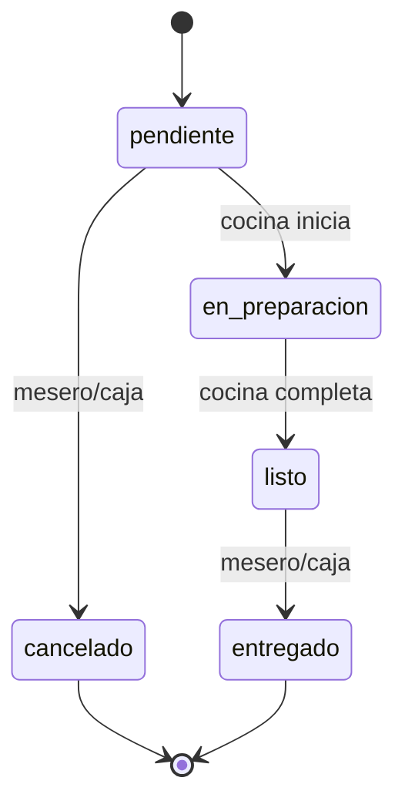
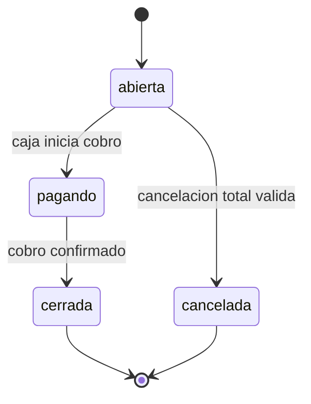
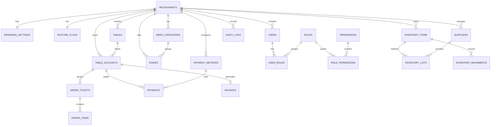
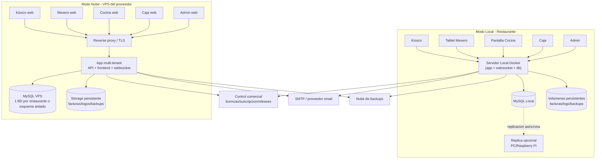
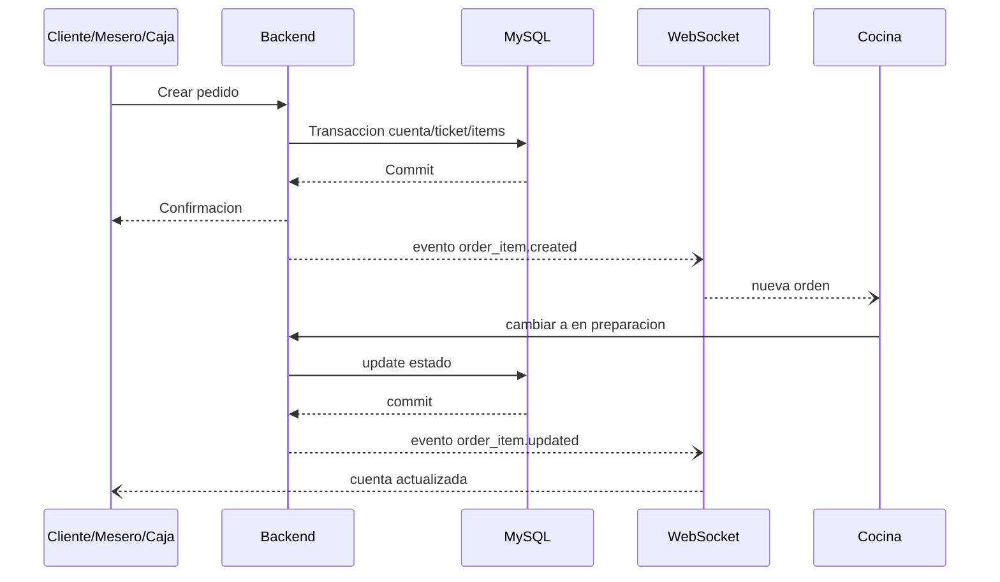

# Requisitos para Sistema de Gestión de Restaurante

*Aplicación web para restaurantes pequeños y medianos de barrio, con operación en tiempo real, despliegue en modo Local o Nube, gestión de licencias/suscripción, facturación PDF y actualizaciones con Docker.*

> Documento consolidado y actualizado a partir del brief funcional original y de la revisión posterior de riesgos, viabilidad comercial, despliegue dual, continuidad operativa y ajustes de alcance.  

---

## 1. Introducción y objetivos

### 1.1 Propósito del documento

Este documento define los requisitos funcionales, no funcionales, el modelo de datos, la arquitectura objetivo, la estrategia de despliegue, la gestión de versiones, la seguridad, el plan de pruebas y los entregables esperados para un sistema de gestión de restaurante orientado a establecimientos pequeños o de barrio.

El documento está diseñado para que un equipo de desarrollo pueda implementar el producto con un nivel profesional, moderno y mantenible, sin depender de supuestos implícitos. También busca servir como base para QA, operaciones, soporte técnico, comercial y documentación de despliegue.

### 1.2 Objetivo del producto

El sistema debe permitir operar integralmente un restaurante mediante una aplicación web accesible desde distintos dispositivos y con distintos perfiles de uso:

* **Cliente** desde kiosco táctil.
* **Mesero** desde tablet o navegador móvil.
* **Cocina** desde PC o pantalla de cocina.
* **Caja** desde PC o tablet de mostrador.
* **Administrador** desde PC.

La solución debe soportar **dos modos de despliegue con la misma experiencia funcional y visual**:

1. **Modo Local**
   Todo el sistema corre dentro del restaurante, normalmente en un PC servidor local. La operación diaria puede continuar aunque Internet falle, siempre que la licencia ya haya sido validada dentro del período de gracia.

2. **Modo Nube**
   El sistema corre en un VPS administrado por el proveedor del software. El restaurante solo necesita dispositivos cliente con Internet. Este modo se comercializa como suscripción mensual y debe permitir aislamiento por restaurante y personalización de marca. 

### 1.3 Contexto de negocio y mercado objetivo

El mercado objetivo son **restaurantes pequeños, locales de barrio, cafeterías y negocios gastronómicos de escala moderada**, no grandes cadenas multinodo. El volumen esperado es modesto: decenas de mesas, algunos dispositivos concurrentes y cientos de pedidos por día, por lo que una arquitectura local bien diseñada sigue siendo plenamente viable y comercialmente razonable. 

Esta restricción de escala no implica una solución improvisada. Al contrario, el sistema debe diseñarse con tecnologías actuales, buenas prácticas de ingeniería, tolerancia razonable a fallos, versionado profesional, pruebas y documentación sólida. El hecho de que el equipo de desarrollo esté dispuesto a aprender una pila moderna permite optar por una arquitectura seria y evolutiva en lugar de una simplificación artificial. 

### 1.4 Objetivos de negocio

El sistema debe contribuir a los siguientes objetivos:

* Reducir tiempos de atención y toma de pedidos.
* Mejorar la coordinación entre kiosco, meseros, cocina y caja.
* Evitar errores manuales y duplicidades.
* Permitir operación en tiempo real.
* Ofrecer un producto comercializable tanto como **licencia local** como **servicio en la nube por suscripción**.
* Mantener bajos los costos de infraestructura mediante tecnologías gratuitas o de bajo costo.
* Proveer facturación PDF y reportes avanzados como parte obligatoria de la versión base.
* Facilitar despliegue, actualización y soporte con Docker.

### 1.5 Principios rectores

* Misma funcionalidad en modo Local y modo Nube.
* Seguridad y auditoría desde la primera versión.
* Tiempo real sin polling agresivo.
* Arquitectura profesional pero proporcionada al tamaño del mercado.
* Despliegue reproducible por contenedores.
* Rollback documentado y operativo.
* Base de datos estable; sin migraciones automáticas en actualizaciones menores o parches.
* Escalabilidad razonable hacia más clientes o tenants sin rehacer la solución.

### 1.6 Alcance funcional de la versión base

La versión base incluye como requisitos obligatorios:

* Gestión de mesas y cuentas de mesa.
* Pedidos por kiosco y por mesero.
* Flujo de cocina por plato.
* Gestión de caja y cierre de cuenta.
* Factura PDF con envío por email.
* Reportes avanzados.
* Gestión de inventario manual con alertas.
* Usuarios, roles y permisos.
* Despliegue dual local/nube.
* Actualización y rollback con Docker.
* Respaldo local y en nube.
* Auditoría de acciones.
* Configuración opcional para que **Caja pueda agregar pedidos directamente** en locales sin mesero. 

### 1.7 Exclusiones y limitaciones

Quedan fuera del alcance inicial, salvo futura ampliación:

* Pasarela de pago bancaria integrada.
* Facturación electrónica fiscal certificada ante la autoridad tributaria.
* Descuento automático de inventario por pedido.
* Gestión multi-sucursal avanzada desde un solo panel operativo.
* Balanceo de carga multi-servidor.
* Alta disponibilidad automática en local sin intervención humana.
* Impresión fiscal certificada.

---

## 2. Actores y roles

### 2.1 Roles principales

| Rol              | Dispositivo habitual    | Autenticación                          | Capacidades base                                                                                            | Restricciones clave                                |
| ---------------- | ----------------------- | -------------------------------------- | ----------------------------------------------------------------------------------------------------------- | -------------------------------------------------- |
| Cliente (kiosco) | Pantalla táctil | Login con credenciales (usuario/contraseña) | Seleccionar mesa libre, elegir platos y enviar pedido nuevo | No modifica, no cancela, no cierra cuentas        |
| Mesero           | Tablet / móvil          | Usuario y contraseña                   | Gestionar varias mesas, agregar pedidos, cancelar platos pendientes, consultar estado de cuenta             | No administra sistema ni inventario                |
| Cocina           | PC / pantalla de cocina | Usuario y contraseña                   | Ver cola de platos, iniciar preparación, marcar listo, consultar inventario en solo lectura                 | No cancela platos ni altera inventario             |
| Caja             | PC / tablet mostrador   | Usuario y contraseña                   | Consultar cuentas, cobrar, cerrar cuenta, generar factura, reenviar factura                                 | No administra el sistema completo                  |
| Administrador    | PC                      | Usuario y contraseña                   | Gestión total de catálogo, inventario, usuarios, permisos, reportes, configuraciones, despliegue y respaldo | Acciones críticas requieren confirmación adicional |

### 2.2 Variación operativa: caja sin mesero

El sistema debe soportar una configuración por establecimiento o por rol llamada, por ejemplo, `cash_can_create_orders`.

Cuando esta opción esté habilitada:

* El usuario de **Caja** podrá crear tickets de pedido y enviar platos a cocina.
* La interfaz de caja mostrará controles adicionales para agregar platos a una cuenta abierta.
* Las acciones de caja como creador de pedidos deben auditarse diferenciando si actuó como caja o como atención directa.
* La habilitación o deshabilitación de esta capacidad debe poder ser gestionada únicamente por el administrador. 

### 2.3 Control de acceso

El sistema debe implementar **RBAC** con permisos granulares. Ejemplos de permisos:

* `auth.login`
* `tables.read`
* `tables.manage`
* `accounts.read`
* `accounts.close`
* `orders.create`
* `orders.cancel_pending`
* `orders.create_from_cash`
* `kitchen.read`
* `kitchen.update_status`
* `payments.create`
* `invoices.generate`
* `invoices.email`
* `reports.read`
* `reports.export`
* `inventory.read`
* `inventory.write`
* `inventory.adjust`
* `users.manage`
* `roles.manage`
* `settings.manage`
* `backups.run`
* `backups.restore`
* `deploy.update`
* `deploy.rollback`
* `license.manage`
* `audit.read`

### 2.4 Reglas de autorización

* Todo endpoint debe validar autenticación y permisos.
* Toda ruta protegida debe impedir acceso directo por URL si el usuario no está autenticado o autorizado.
* Las acciones no permitidas no deben mostrarse en la interfaz.
* En modo Nube, la autorización debe considerar también el `tenant_id` del restaurante para impedir acceso cruzado entre establecimientos.
* Las acciones críticas deben quedar auditadas.

---

## 3. Requisitos funcionales

### 3.1 Requisitos globales del sistema

* **RF-GEN-001:** El sistema debe ofrecer la misma experiencia de usuario y la misma funcionalidad principal en modo Local y modo Nube.
* **RF-GEN-002:** La diferencia entre modos debe residir en la ubicación del backend, la base de datos y el modelo comercial, no en el flujo operativo.
* **RF-GEN-003:** El sistema debe permitir parametrización por establecimiento: nombre comercial, logo, colores, identificación fiscal, dirección, teléfonos, email, texto legal y numeración.
* **RF-GEN-004:** En modo Nube, cada restaurante debe operar de manera aislada y no debe poder ver, consultar ni afectar datos de otro establecimiento.
* **RF-GEN-005:** El sistema debe registrar auditoría de acciones relevantes y mantener trazabilidad por usuario, fecha, entidad y tenant.
* **RF-GEN-006:** Reportes avanzados y factura PDF con envío por email deben formar parte obligatoria de la versión base. 

### 3.2 Autenticación, sesiones y usuarios

* **RF-AUT-001:** Debe existir autenticación por usuario y contraseña para mesero, cocina, caja y administrador.
* **RF-AUT-002:** Debe existir modo kiosco sin login humano, restringido a la interfaz de cliente.
* **RF-AUT-003:** El administrador debe poder crear, editar, activar, desactivar y reasignar usuarios.
* **RF-AUT-004:** El administrador debe poder crear roles y asignar permisos granulares.
* **RF-AUT-005:** Las contraseñas deben poder cambiarse por el usuario autenticado o restablecerse por un administrador.
* **RF-AUT-006:** Debe existir cierre automático por inactividad, con valor por defecto de 30 minutos.
* **RF-AUT-007:** Debe existir expiración absoluta de sesión, con valor recomendado de 8 horas.
* **RF-AUT-008:** Todo intento fallido de acceso debe quedar auditado.
* **RF-AUT-009:** La desactivación de un usuario debe invalidar sus sesiones activas.
* **RF-AUT-010:** En modo Nube, la autenticación debe estar siempre asociada a un tenant.
* **RF-AUT-011:** El rol Cliente (kiosco) debe tener cuentas de usuario gestionadas por el administrador, con permisos limitados exclusivamente a la creación de pedidos.
* **RF-AUT-012:** El campo de inicio de sesión será el correo electrónico (único por usuario) más la contraseña. No se usará nombre de usuario.


### 3.3 Gestión de mesas y cuentas

* **RF-MES-001:** El administrador debe poder configurar el número de mesas del restaurante.
* **RF-MES-002:** Cada mesa debe tener número fijo, visible y único.
* **RF-MES-003:** Los estados de mesa deben incluir al menos: `libre`, `ocupada`, `pagando`, `deshabilitada`.
* **RF-MES-004:** Una mesa no debe tener más de una cuenta activa a la vez.
* **RF-MES-005:** El primer pedido válido para una mesa libre debe abrir automáticamente la cuenta de mesa.
* **RF-MES-006:** Los estados de cuenta deben incluir al menos: `abierta`, `pagando`, `cerrada`, `cancelada`.
* **RF-MES-007:** Una cuenta cerrada no debe aceptar nuevos pedidos.
* **RF-MES-008:** Una cuenta en estado `pagando` no debe aceptar nuevos pedidos salvo reversión autorizada.
* **RF-MES-009:** El sistema debe mostrar para cada mesa el resumen de cuenta activa: ítems, subtotal, total, estado y última actualización.
* **RF-MES-010:** La cancelación total de una cuenta debe validarse según el estado de sus platos.

#### Flujo de estados de plato



#### Flujo de estados de cuenta



### 3.4 Kiosco táctil

* **RF-KIO-000:** El kiosco debe exigir autenticación mediante credenciales (correo y contraseña) antes de mostrar la interfaz de pedidos. La sesión del kiosco puede mantenerse activa durante largos periodos sin cierre automático (configurable por el administrador).
* **RF-KIO-001:** El kiosco debe mostrar solo mesas disponibles para iniciar pedido.
* **RF-KIO-002:** Debe permitir seleccionar mesa por número fijo.
* **RF-KIO-003:** Debe permitir explorar el menú por categoría.
* **RF-KIO-004:** Debe permitir revisar el pedido antes de enviarlo.
* **RF-KIO-005:** Una vez enviado el pedido, el kiosco debe volver al estado inicial y quedar libre.
* **RF-KIO-006:** El cliente no debe poder cancelar ni editar pedidos ya enviados.
* **RF-KIO-007:** Debe prevenir doble envío por toques repetidos.
* **RF-KIO-008:** Debe operar con botones grandes y navegación simple.
* **RF-KIO-009:** El origen del ticket debe quedar marcado como `kiosco`.
* **RF-KIO-010:** En modo Nube o Local, el comportamiento del kiosco debe ser idéntico.

### 3.5 Módulo de mesero

* **RF-MESR-001:** El mesero debe visualizar mesas y estados.
* **RF-MESR-002:** Debe abrir el detalle de una mesa y consultar su cuenta.
* **RF-MESR-003:** Debe agregar platos a cuentas abiertas.
* **RF-MESR-004:** Debe cancelar solo platos en estado `pendiente`.
* **RF-MESR-005:** Debe consultar avance de cocina en tiempo real.
* **RF-MESR-006:** Debe ver subtotal, impuestos, descuentos configurables y total.
* **RF-MESR-007:** Debe registrar observaciones por ticket o por plato.
* **RF-MESR-008:** Debe recibir notificación cuando un plato quede `listo`.
* **RF-MESR-009:** Debe poder marcar platos como `entregado` si el flujo del negocio lo usa.
* **RF-MESR-010:** Todas sus acciones deben quedar auditadas.

### 3.6 Módulo de cocina

* **RF-COC-001:** Cocina debe ver una cola de platos pendientes y en preparación.
* **RF-COC-002:** La unidad operativa debe ser el plato, no únicamente el pedido completo.
* **RF-COC-003:** Cocina debe poder cambiar `pendiente` a `en preparación`.
* **RF-COC-004:** Cocina debe poder cambiar `en preparación` a `listo`.
* **RF-COC-005:** Debe visualizar mesa, hora de creación, tiempo transcurrido y observaciones.
* **RF-COC-006:** Debe filtrar por estado y ordenar por antigüedad.
* **RF-COC-007:** Debe poder consultar inventario en solo lectura.
* **RF-COC-008:** No debe poder cancelar platos ni editar inventario.
* **RF-COC-009:** Debe soportar múltiples pantallas de cocina sincronizadas.
* **RF-COC-010:** Los cambios en cocina deben reflejarse en tiempo real para mesero y caja.

### 3.7 Módulo de caja

* **RF-CAJ-001:** Caja debe visualizar todas las mesas y cuentas activas.
* **RF-CAJ-002:** Debe consultar el detalle completo de una cuenta.
* **RF-CAJ-003:** Debe poder mover una cuenta de `abierta` a `pagando`.
* **RF-CAJ-004:** Debe registrar pagos con método configurable.
* **RF-CAJ-005:** Debe poder cerrar la cuenta si no existen platos en `en preparación`.
* **RF-CAJ-006:** Debe generar factura PDF al cierre.
* **RF-CAJ-007:** Debe permitir ingresar email del cliente y enviar factura.
* **RF-CAJ-008:** Debe poder reenviar facturas ya emitidas.
* **RF-CAJ-009:** Debe poder cancelar platos solo si aún están `pendiente`.
* **RF-CAJ-010:** Si `cash_can_create_orders` está habilitado, Caja debe poder agregar platos a la cola de pedidos sin pasar por un usuario de mesero.
* **RF-CAJ-011:** Las acciones de caja como creador de pedidos deben quedar diferenciadas en reportes y auditoría.
* **RF-CAJ-012:** Si la configuración está deshabilitada, Caja no debe ver controles de creación de pedidos.

### 3.8 Administración general

* **RF-ADM-001:** El administrador debe poder gestionar categorías de platos.
* **RF-ADM-002:** Debe poder gestionar platos, disponibilidad, precios e imágenes.
* **RF-ADM-003:** Los cambios de precio no deben alterar el histórico de pedidos ya registrados.
* **RF-ADM-004:** Debe poder gestionar métodos de pago.
* **RF-ADM-005:** Debe poder configurar datos fiscales y visuales del restaurante, incluyendo logo y colores.
* **RF-ADM-006:** Debe poder gestionar usuarios, roles y permisos.
* **RF-ADM-007:** Debe poder consultar auditoría con filtros.
* **RF-ADM-008:** Debe poder configurar parámetros globales del sistema.
* **RF-ADM-009:** Debe poder habilitar o deshabilitar kiosco, caja con pedidos, alertas, envío de facturas por email y políticas de respaldo.
* **RF-ADM-010:** Debe poder consultar estado de licencia o suscripción, versión instalada y canal de actualización.
* **RF-ADM-011:** Debe poder ejecutar respaldo, restauración, actualización y rollback mediante herramientas documentadas.
* **RF-ADM-012:** En modo Nube, debe poder consultar la marca propia del establecimiento y sus parámetros visuales.

### 3.9 Inventario

* **RF-INV-001:** Solo el administrador debe poder crear y editar productos de inventario.
* **RF-INV-002:** Cada producto debe soportar unidad de medida, stock mínimo y estado activo.
* **RF-INV-003:** Deben existir lotes, proveedor y fecha de vencimiento.
* **RF-INV-004:** Debe soportar movimientos manuales: ingreso, ajuste, consumo manual, desperdicio y corrección.
* **RF-INV-005:** Deben existir alertas de stock mínimo.
* **RF-INV-006:** Deben existir alertas por productos próximos a vencer.
* **RF-INV-007:** El inventario no debe descontarse automáticamente por cada pedido.
* **RF-INV-008:** Cocina solo debe ver inventario en solo lectura.
* **RF-INV-009:** Cada movimiento debe registrar usuario, fecha, motivo y lote si corresponde.
* **RF-INV-010:** El estado de inventario debe poder exportarse.

### 3.10 Reportes obligatorios

Los reportes avanzados son requisito obligatorio de la versión base. 

* **RF-REP-001:** Reporte de ventas totales por rango de fechas.
* **RF-REP-002:** Reporte de ventas por método de pago.
* **RF-REP-003:** Reporte de ventas por mesero.
* **RF-REP-004:** Reporte de ventas originadas por kiosco.
* **RF-REP-005:** Reporte de platos más vendidos.
* **RF-REP-006:** Reporte de tiempo promedio de preparación.
* **RF-REP-007:** Reporte de desperdicios y ajustes de inventario.
* **RF-REP-008:** Reporte de productos próximos a vencer.
* **RF-REP-009:** Reporte de desempeño de empleados.
* **RF-REP-010:** Exportación obligatoria a PDF y CSV compatible con Excel.
* **RF-REP-011:** Todos los reportes deben admitir filtros por fecha y, cuando aplique, por usuario, mesa, método de pago, canal de origen o categoría.
* **RF-REP-012:** El acceso a reportes debe estar protegido por permisos.

### 3.11 Facturación y comprobantes

La factura PDF y su envío por correo son requisitos obligatorios de la versión base. 

* **RF-FAC-001:** Al cerrar una cuenta debe generarse una factura o comprobante PDF.
* **RF-FAC-002:** El PDF debe incluir logo, nombre comercial, NIF/NIT/RUC, dirección, teléfono, email y texto legal configurable.
* **RF-FAC-003:** Cada factura debe tener número consecutivo único por restaurante.
* **RF-FAC-004:** El PDF debe almacenarse en la estructura `facturas/año/mes/dia/factura_XXXXX.pdf`.
* **RF-FAC-005:** Debe poder enviarse por email al cliente.
* **RF-FAC-006:** Debe registrarse el resultado del envío.
* **RF-FAC-007:** Debe conservarse histórico y trazabilidad entre factura, cuenta, pagos y usuario que cerró.
* **RF-FAC-008:** Debe existir firma simulada, hash o sello de integridad, aunque no sea firma fiscal certificada.
* **RF-FAC-009:** Debe poder reemitirse o reenviarse una factura ya generada sin alterar la numeración.
* **RF-FAC-010:** El sistema debe proporcionar un botón en la interfaz de caja para imprimir físicamente la factura en una impresora térmica o de inyección conectada al dispositivo (localmente o mediante red). La impresión debe generar un formato compatible con impresoras de tickets (ancho 80mm o similar) y ser configurable por el administrador (tamaño, encabezado, pie de página). En modo Local, la impresión se enviará a la impresora predeterminada del sistema; en modo Nube, se requerirá una impresora compartida en red o se usará un mecanismo de diálogo de impresión del navegador.

### 3.12 Modos de despliegue dual

#### 3.12.1 Modo Local

* **RF-DEP-LOC-001:** El sistema debe poder desplegarse íntegramente dentro del restaurante.
* **RF-DEP-LOC-002:** La base de datos, backend y frontend deben correr en el servidor local.
* **RF-DEP-LOC-003:** Tras una validación de licencia exitosa, el sistema debe poder seguir operando aunque Internet falle, durante un período de gracia configurable.
* **RF-DEP-LOC-004:** El acceso de los dispositivos clientes debe ser por LAN.
* **RF-DEP-LOC-005:** Debe existir validación periódica de licencia cuando vuelva la conectividad.

#### 3.12.2 Modo Nube

* **RF-DEP-CLO-001:** El sistema debe poder desplegarse en un VPS gestionado por el proveedor.
* **RF-DEP-CLO-002:** Los restaurantes deben acceder por Internet.
* **RF-DEP-CLO-003:** Cada restaurante debe tener aislamiento de datos.
* **RF-DEP-CLO-004:** Cada restaurante debe poder configurar logo, colores y nombre.
* **RF-DEP-CLO-005:** En modo Nube, cada restaurante debe tener su propia base de datos aislada (no compartida). Además, debe desplegarse una instancia independiente de la aplicación web por restaurante (contenedor o grupo de contenedores dedicados), permitiendo personalización de colores, logo, usuarios y configuraciones específicas sin afectar a otros clientes.
* **RF-DEP-CLO-006:** El modelo comercial del modo Nube debe soportar suscripción mensual y control de vigencia.
* **RF-DEP-CLO-007:** La experiencia del usuario debe ser equivalente a la del modo Local.

### 3.13 Alta disponibilidad local opcional

Esta capacidad no es obligatoria para todos los clientes, pero debe quedar contemplada como opción comercial y técnica.

* **RF-HA-001:** En modo Local, debe poder configurarse un segundo equipo como réplica básica del servidor principal.
* **RF-HA-002:** La réplica podrá ser un PC secundario o una Raspberry Pi con recursos suficientes.
* **RF-HA-003:** La base de datos debe poder replicarse en tiempo real de forma asíncrona.
* **RF-HA-004:** Si el servidor principal falla, debe existir un procedimiento manual o semiautomático para apuntar a los clientes al secundario.
* **RF-HA-005:** El objetivo de recuperación operativo debe ser menor a 5 minutos.
* **RF-HA-006:** La documentación debe advertir que, por ser replicación asíncrona, podría perderse una pequeña ventana de cambios recientes en una caída abrupta.
* **RF-HA-007:** Esta funcionalidad debe activarse solo si el restaurante adquiere hardware adicional.
* **RF-HA-008:** La versión base del producto debe seguir siendo plenamente funcional sin esta opción.

### 3.14 Licencias, suscripción y operación comercial

* **RF-LIC-001:** El sistema debe soportar licenciamiento por establecimiento en modo Local.
* **RF-LIC-002:** El sistema debe soportar suscripción mensual por establecimiento en modo Nube.
* **RF-LIC-003:** La licencia o suscripción debe almacenar establecimiento, estado, fecha de expiración, canal de versión y metadatos comerciales.
* **RF-LIC-004:** Debe existir una base de datos central en la nube (accesible por Internet) que almacene las licencias, suscripciones, fechas de expiración, estado de pago y datos del restaurante. La aplicación (tanto en modo Local como en modo Nube) debe consultar esta base de datos al iniciar y periódicamente para verificar la vigencia de la licencia. Si no hay conexión en el inicio, se usará la última validación exitosa almacenada localmente (período de gracia configurable). Si la licencia expira o se revoca, el sistema debe mostrar un mensaje de contacto con el proveedor y bloquear nuevas operaciones.
* **RF-LIC-005:** En modo Local debe existir caché de última validación exitosa y política de gracia.
* **RF-LIC-006:** En modo Nube debe existir control de tenant activo y estado comercial.
* **RF-LIC-007:** El panel administrativo debe mostrar fecha de vigencia, última validación y versión desplegada.

### 3.15 Despliegue, actualizaciones y rollback con Docker

La estrategia de empaquetado y despliegue debe basarse en contenedores Docker. Docker documenta Compose como la herramienta para definir y ejecutar aplicaciones multi-contenedor, `docker compose up` como el comando para crear e iniciar servicios, y los perfiles de Compose como mecanismo para activar servicios opcionales según entorno o caso de uso. GitHub Releases permite distribuir artefactos binarios y notas de versión, y Docker Hub versiona imágenes mediante etiquetas. ([Docker Documentation][1])

* **RF-UPD-001:** El producto debe distribuirse como imágenes Docker versionadas y archivos de configuración de despliegue.
* **RF-UPD-002:** Debe existir un archivo `compose.yaml` base y archivos adicionales o perfiles para variantes Local, Nube y HA opcional.
* **RF-UPD-003:** El administrador o soporte debe poder levantar el sistema con un comando estándar de Docker Compose.
* **RF-UPD-004:** Antes de actualizar, el sistema o el procedimiento documentado debe ejecutar backup de base de datos.
* **RF-UPD-005:** Debe conservarse la imagen anterior o, como mínimo, la referencia exacta de tag instalada.
* **RF-UPD-006:** Las actualizaciones deben realizarse con `docker compose pull` y recreación controlada de contenedores.
* **RF-UPD-007:** Debe existir verificación simple de disponibilidad de una nueva versión mediante consulta a un registro público o API.
* **RF-UPD-008:** Debe existir un script o procedimiento de rollback documentado.
* **RF-UPD-009:** Si la nueva versión falla en health-check, debe ser posible volver a la versión anterior con una ventana de recuperación reducida.
* **RF-UPD-010:** Las actualizaciones menores y parches no deben ejecutar migraciones automáticas de esquema.
* **RF-UPD-011:** Si una actualización requiere cambio de esquema, debe clasificarse como versión mayor y requerir mantenimiento planificado.
* **RF-UPD-012:** Para restaurantes sin conocimientos técnicos, debe ofrecerse soporte remoto o actualización en horario de cierre.

### 3.16 Respaldos y restauración

* **RF-BKP-001:** Debe existir respaldo local manual y programado.
* **RF-BKP-002:** Debe existir respaldo remoto o en nube configurable.
* **RF-BKP-003:** El administrador debe poder seleccionar el proveedor de respaldo.
* **RF-BKP-004:** Debe existir restauración guiada y documentada.
* **RF-BKP-005:** Debe poder restaurarse únicamente la base de datos o un paquete completo de datos persistentes.
* **RF-BKP-006:** Las operaciones de respaldo y restauración deben quedar auditadas.
* **RF-BKP-007:** El sistema debe realizar backups automáticos programados diariamente (por defecto a las 3 AM) y también antes de cada actualización. Los backups se almacenarán tanto en local como en la nube (configurable). El administrador podrá ejecutar backups manuales en cualquier momento.

### 3.17 Auditoría y trazabilidad

* **RF-AUD-001:** Toda acción crítica debe registrarse en `audit_logs`.
* **RF-AUD-002:** Deben auditarse inicios de sesión, cierres, cambios de estado, cancelaciones, cobros, facturas, inventario, cambios de permisos, actualizaciones y respaldos.
* **RF-AUD-003:** Los logs de auditoría no deben ser editables desde la interfaz.
* **RF-AUD-004:** En modo Nube, la auditoría debe incluir identificación del tenant.
* **RF-AUD-005:** Debe existir consulta por filtros de fecha, usuario, entidad y acción.

---

## 4. Requisitos no funcionales

### 4.1 Rendimiento y capacidad objetivo

El sistema está orientado a restaurantes pequeños, por lo que la capacidad base debe cubrir con holgura escenarios como 10 a 50 mesas, varios puestos de trabajo simultáneos, una o dos pantallas de cocina y cientos de pedidos al día. Ese contexto hace viable un despliegue local bien dimensionado, sin exigir infraestructura de cadena grande. 

| Categoría    | Requisito                                   | Criterio objetivo                                                               |
| ------------ | ------------------------------------------- | ------------------------------------------------------------------------------- |
| Lecturas     | Respuesta de consultas comunes              | < 1 segundo en LAN, < 2 segundos en nube                                      |
| Escrituras   | Crear pedido, cambiar estado, cerrar cuenta | < 1.5 segundos en LAN, < 2.5 segundos en nube                                   |
| Tiempo real  | Propagación de eventos                      | < 3 segundos entre clientes conectados                                 |
| Concurrencia | Usuarios simultáneos                        | 20 usuarios sin degradación visible para el usuario final |
| Catálogo     | Carga de menú                               | < 3 segundos                                                       |
| Reportes     | Reportes medianos                           | < 15 segundos para rangos típicos

**Nota:** Estos valores son orientativos. Dado el mercado objetivo (restaurantes pequeños), el rendimiento no es un factor crítico mientras la experiencia de usuario sea fluida. Se priorizará la corrección funcional y la simplicidad sobre la optimización extrema.                                           |

### 4.2 Disponibilidad y recuperación

| Escenario                  | Objetivo                                                |
| -------------------------- | ------------------------------------------------------- |
| Modo Local base            | Recuperación por reinicio manual o automático razonable |
| Modo Local con HA opcional | RTO operativo < 5 min                                   |
| Modo Nube                  | Recuperación según reinicio de contenedores o VPS       |
| Backup programado          | Debe ejecutarse sin interrumpir operación normal        |
| Rollback de versión        | Debe poder realizarse en una sola ventana operativa     |

### 4.3 Seguridad

* Contraseñas con hash robusto.
* Control RBAC en backend y frontend.
* Aislamiento por tenant en nube.
* Validación de entradas.
* Protección frente a inyección y XSS.
* Gestión segura de secretos.
* Auditoría completa.
* Caducidad de sesiones.
* Restricción de exposición pública en modo Local.

### 4.4 Usabilidad

* Interfaz responsive.
* Diseño táctil real para kiosco.
* Navegación simple.
* Estados visuales claros.
* Bajo número de pasos para tareas repetitivas.
* Coherencia entre roles.

### 4.5 Mantenibilidad

* Código modular por dominio.
* Versionado semántico.
* Contenedores reproducibles.
* Configuración separada del código.
* Scripts documentados para despliegue y rollback.
* Pruebas automatizadas.
* Logs estructurados.

### 4.6 Portabilidad

La pila recomendada debe poder ejecutarse en Windows, Linux y macOS, y también en entornos VPS Linux. Node.js es un runtime libre, open source y multiplataforma; Express es un framework minimalista y flexible; React se basa en componentes reutilizables; Vite está orientado a un desarrollo frontend rápido; Socket.IO ofrece comunicación bidireccional y de baja latencia; Prisma gestiona conexiones y pool; Docker Compose define y ejecuta aplicaciones multi-contenedor. ([Node.js][2])

### 4.7 Observabilidad

* Deben existir logs técnicos y logs de negocio separados.
* Deben existir endpoints de health-check.
* Debe existir trazabilidad por request o correlación.
* Deben existir métricas mínimas de disponibilidad, errores y latencia.
* En modo Nube debe ser posible diferenciar métricas por tenant.

### 4.8 Escalabilidad

* La arquitectura debe soportar crecimiento a más restaurantes en nube sin rehacer el sistema.
* Debe poder añadirse caché o cola en futuras versiones.
* Debe poder migrarse a contenedores por tenant para clientes premium si el negocio crece.
* Debe poder añadirse un reverse proxy TLS y observabilidad más avanzada sin reescribir el núcleo.

---

## 5. Modelo de datos

### 5.1 Principios de diseño

* Los datos históricos no deben romperse por cambios de catálogo.
* Los pedidos deben guardar snapshot de nombre y precio del plato.
* Las tablas críticas deben soportar control de concurrencia.
* Las entidades auditables deben incluir timestamps y usuario cuando corresponda.
* En modo Nube, el modelo debe soportar `tenant_id` o bases separadas por restaurante.
* Se recomienda que el control comercial de licencias/suscripciones viva separado del dato operativo del restaurante.

### 5.2 Entidades principales

#### 5.2.1 Multiinquilino y configuración de marca

* **restaurants**

  * `id`
  * `code`
  * `name`
  * `tax_id`
  * `address`
  * `phone`
  * `email`
  * `deployment_mode` (`local`, `cloud`)
  * `active`
  * `created_at`
  * `updated_at`

* **branding_settings**

  * `id`
  * `restaurant_id`
  * `logo_path`
  * `primary_color`
  * `secondary_color`
  * `display_name`
  * `invoice_footer`
  * `updated_at`

* **feature_flags**

  * `id`
  * `restaurant_id`
  * `cash_can_create_orders`
  * `kiosk_enabled`
  * `invoice_email_enabled`
  * `ha_enabled`
  * `updated_at`

#### 5.2.2 Seguridad

* **users**

  * `id`
  * `restaurant_id`
  * `username`
  * `full_name`
  * `password_hash`
  * `active`
  * `last_login_at`
  * `created_at`
  * `updated_at`

* **roles**

  * `id`
  * `code`
  * `name`
  * `description`

* **permissions**

  * `id`
  * `code`
  * `name`
  * `description`

* **user_roles**

  * `user_id`
  * `role_id`

* **role_permissions**

  * `role_id`
  * `permission_id`

#### 5.2.3 Operación comercial

* **tables**

  * `id`
  * `restaurant_id`
  * `table_number`
  * `enabled`
  * `display_order`
  * `created_at`
  * `updated_at`

* **table_accounts**

  * `id`
  * `restaurant_id`
  * `table_id`
  * `status`
  * `origin`
  * `opened_by_user_id`
  * `opened_at`
  * `closed_at`
  * `subtotal_amount`
  * `tax_amount`
  * `discount_amount`
  * `total_amount`
  * `version`

* **order_tickets**

  * `id`
  * `restaurant_id`
  * `table_account_id`
  * `origin` (`kiosco`, `mesero`, `caja`)
  * `created_by_user_id`
  * `notes`
  * `created_at`

* **order_items**

  * `id`
  * `restaurant_id`
  * `order_ticket_id`
  * `dish_id`
  * `dish_name_snapshot`
  * `unit_price_snapshot`
  * `quantity`
  * `notes`
  * `status`
  * `kitchen_started_at`
  * `ready_at`
  * `delivered_at`
  * `canceled_at`
  * `canceled_by_user_id`
  * `version`

#### 5.2.4 Catálogo

* **menu_categories**

  * `id`
  * `restaurant_id`
  * `name`
  * `sort_order`
  * `active`

* **dishes**

  * `id`
  * `restaurant_id`
  * `category_id`
  * `name`
  * `description`
  * `price`
  * `active`
  * `available_for_sale`
  * `image_url`
  * `created_at`
  * `updated_at`

#### 5.2.5 Caja y facturación

* **payment_methods**

  * `id`
  * `restaurant_id`
  * `code`
  * `name`
  * `active`

* **payments**

  * `id`
  * `restaurant_id`
  * `table_account_id`
  * `payment_method_id`
  * `amount`
  * `reference`
  * `received_by_user_id`
  * `paid_at`

* **invoice_sequences**

  * `id`
  * `restaurant_id`
  * `current_value`
  * `updated_at`

* **invoices**

  * `id`
  * `restaurant_id`
  * `table_account_id`
  * `invoice_number`
  * `pdf_path`
  * `signature_hash_mock`
  * `customer_email`
  * `email_status`
  * `emailed_at`
  * `issued_by_user_id`
  * `issued_at`

#### 5.2.6 Inventario

* **inventory_items**

  * `id`
  * `restaurant_id`
  * `sku`
  * `name`
  * `unit_of_measure`
  * `minimum_stock`
  * `current_stock`
  * `active`
  * `version`

* **suppliers**

  * `id`
  * `restaurant_id`
  * `name`
  * `tax_id`
  * `contact_name`
  * `phone`
  * `email`
  * `address`

* **inventory_lots**

  * `id`
  * `restaurant_id`
  * `inventory_item_id`
  * `supplier_id`
  * `batch_code`
  * `quantity_initial`
  * `quantity_available`
  * `expiration_date`
  * `received_at`

* **inventory_movements**

  * `id`
  * `restaurant_id`
  * `inventory_item_id`
  * `inventory_lot_id`
  * `movement_type`
  * `quantity`
  * `reason`
  * `created_by_user_id`
  * `created_at`

#### 5.2.7 Operaciones y soporte

* **audit_logs**

  * `id`
  * `restaurant_id`
  * `user_id`
  * `action`
  * `entity_type`
  * `entity_id`
  * `before_json`
  * `after_json`
  * `ip_address`
  * `user_agent`
  * `created_at`

* **app_settings**

  * `id`
  * `restaurant_id`
  * `key`
  * `value`
  * `updated_by_user_id`
  * `updated_at`

* **backup_jobs**

  * `id`
  * `restaurant_id`
  * `target_type`
  * `provider`
  * `status`
  * `started_at`
  * `finished_at`
  * `file_path`
  * `created_by_user_id`

* **deployment_history**

  * `id`
  * `restaurant_id`
  * `version_from`
  * `version_to`
  * `status`
  * `backup_path`
  * `rollback_available`
  * `started_at`
  * `finished_at`
  * `executed_by_user_id`

### 5.3 Control plane comercial recomendado

Esta base de datos de control estará alojada en un VPS separado o en un servicio como Supabase (gratis) y contendrá las tablas licenses, subscriptions, release_channels. No contiene datos operativos de los restaurantes.

Fuera de la base operativa del restaurante, se recomienda un pequeño plano de control comercial:

* **licenses**

  * `license_key`
  * `restaurant_code`
  * `status`
  * `expires_at`
  * `allowed_channel`
  * `last_validated_at`

* **subscriptions**

  * `restaurant_code`
  * `plan`
  * `status`
  * `billing_cycle`
  * `next_due_at`

* **release_channels**

  * `channel`
  * `latest_version`
  * `min_supported_version`
  * `requires_manual_migration`

### 5.4 Relaciones principales



### 5.5 Restricciones e índices mínimos

* Índice único en `tables(restaurant_id, table_number)`.
* Restricción de una sola cuenta activa por mesa.
* Índice en `table_accounts(restaurant_id, status, table_id)`.
* Índice en `order_items(restaurant_id, status, created_at)`.
* Índice en `payments(restaurant_id, table_account_id)`.
* Índice único en `invoices(restaurant_id, invoice_number)`.
* Índice en `inventory_lots(restaurant_id, expiration_date)`.
* Índice en `audit_logs(restaurant_id, created_at, user_id, action)`.
* En modo Nube, todo acceso debe filtrar por `restaurant_id` o resolverse por base de datos dedicada.

### 5.6 Estrategia de aislamiento en nube

Se permiten dos estrategias:

1. **Base de datos separada por restaurante**
   Recomendación principal para el proyecto inicial, por claridad operativa, respaldo más simple y menor riesgo de fuga entre tenants.

2. **Esquema separado por restaurante**
   Alternativa válida si la operación exige reducir número de bases.

Para el mercado objetivo de restaurantes pequeños, se recomienda **una sola instancia MySQL por VPS con una base por restaurante**, más una base o servicio de control compartido para licencias, releases y metadatos de suscripción.

---

## 6. Arquitectura sugerida

### 6.1 Resumen arquitectónico

La solución debe poder desplegarse en dos topologías principales:

* **Topología Local**: servidor Docker dentro del restaurante.
* **Topología Nube**: VPS multiinquilino administrado por el proveedor.

En ambos casos, el frontend, la API y el tiempo real deben funcionar de manera equivalente para el usuario final.

### 6.2 Componentes lógicos

1. **Frontend web**

   * SPA responsive.
   * Rutas por rol.
   * Comunicación HTTP + WebSocket.

2. **Backend**

   * API REST.
   * WebSocket / Socket.IO.
   * Dominio de negocio: mesas, pedidos, cocina, caja, facturas, inventario, reportes, usuarios, auditoría.

3. **Persistencia**

   * MySQL para datos transaccionales.
   * Sistema de archivos o volumen persistente para facturas, logs, respaldos y assets.

4. **Servicios de soporte**

   * Email.
   * Backups a nube.
   * Verificación de licencia o suscripción.
   * Registro de versiones.

### 6.3 Diagrama general de despliegue dual



### 6.4 Arquitectura por contenedores

Docker Compose se recomienda como mecanismo de empaquetado base porque está diseñado para aplicaciones multi-contenedor y permite combinar servicios, perfiles y archivos de configuración por entorno. GitHub Releases puede distribuir paquetes complementarios y Docker Hub o un registry equivalente puede distribuir imágenes etiquetadas por versión. ([Docker Documentation][1])

Servicios recomendados:

* `app`: backend Node.js sirviendo API, frontend compilado y Socket.IO.
* `db`: MySQL 8.
* `backup`: job o contenedor utilitario para respaldos.
* `proxy` (solo nube o instalaciones locales avanzadas): reverse proxy.
* `replica-db` (solo perfil HA opcional): réplica MySQL.
* `restore-tool` (ejecución puntual): restauración y tareas administrativas.

### 6.5 Principios de arquitectura

* Misma aplicación lógica para Local y Nube.
* Diferenciar configuración por variables de entorno.
* Separar claramente código, datos persistentes y secretos.
* Evitar dependencia en una app de escritorio propietaria.
* Mantener un proceso de actualización estándar y reproducible.
* Preparar el diseño para multi-tenant, aunque un restaurante local use una sola base.

### 6.6 Flujo de datos operativo



---

## 7. Tecnologías recomendadas

### 7.1 Pila recomendada

Se recomienda una pila moderna, gratuita y ampliamente documentada:

* **Frontend:** React + Vite + TypeScript + Tailwind CSS.
* **Backend:** Node.js + Express + Socket.IO + Prisma ORM.
* **Base de datos:** MySQL 8 con InnoDB.
* **Despliegue:** Docker + Docker Compose.
* **Facturación PDF:** Puppeteer.
* **Email:** Nodemailer sobre SMTP, con posibilidad de proveedor gestionado.
* **Backups:** `mysqldump` + `rclone`.
* **Pruebas:** Vitest + Playwright + k6 o Artillery.

Las fuentes oficiales describen React como una librería para construir interfaces componibles, Vite como tooling frontend rápido, Node.js como runtime libre y multiplataforma, Express como framework minimalista, Socket.IO como comunicación bidireccional y de baja latencia, Prisma como cliente con gestión de pool de conexiones, MySQL con soporte de aislamiento transaccional y replicación, Puppeteer con generación de PDF mediante `Page.pdf()`, Nodemailer con transporte SMTP universal y rclone con soporte para múltiples servicios cloud. ([React][3])

### 7.2 Tabla de decisión tecnológica

| Capa        | Recomendación principal   | Alternativa válida      | Motivo                                                                          |
| ----------- | ------------------------- | ----------------------- | ------------------------------------------------------------------------------- |
| Frontend    | React + Vite + TypeScript | Vue 3 + Vite            | Ecosistema amplio, componentes reutilizables, buen soporte para SPA empresarial |
| UI          | Tailwind CSS              | Bootstrap               | Rapidez para UI responsive y táctil                                             |
| Backend     | Node.js + Express         | FastAPI                 | Menor fricción al compartir TypeScript entre frontend y backend                 |
| Tiempo real | Socket.IO                 | SSE                     | Mejor ergonomía para eventos bidireccionales                                    |
| ORM         | Prisma                    | SQLAlchemy / Knex       | Productividad, tipado y consistencia                                            |
| DB          | MySQL 8                   | MariaDB                 | Robustez, réplica y soporte transaccional sólido                                |
| Despliegue  | Docker Compose            | Scripts nativos por SO  | Reproducibilidad y soporte remoto más fácil                                     |
| PDF         | Puppeteer                 | wkhtmltopdf / ReportLab | Alta fidelidad visual con plantillas HTML                                       |
| Email       | Nodemailer SMTP           | Resend / SendGrid       | Bajo costo y flexibilidad                                                       |
| Backups     | mysqldump + rclone        | XtraBackup + rclone     | Simplicidad suficiente para el tamaño objetivo                                  |
| Testing     | Vitest + Playwright       | Jest + Cypress          | Buen encaje con Vite y flujos E2E reales                                        |

### 7.3 Justificación de Node.js sobre Python

Aunque Python con FastAPI es una alternativa excelente, para este proyecto se recomienda **Node.js + Express + Socket.IO** por estas razones:

* Unificación del lenguaje en frontend y backend.
* Excelente integración con Socket.IO.
* Menor fricción para un equipo pequeño que quiere aprender una pila moderna de producto web.
* Buena compatibilidad con Puppeteer y herramientas de empaquetado Docker.
* Menor dispersión tecnológica en la fase inicial.

### 7.4 Justificación de Docker como estrategia central

Docker Docs define Compose como la forma de definir y ejecutar aplicaciones multi-contenedor, y `docker compose up` como el comando que crea e inicia los servicios. Los perfiles permiten activar servicios opcionales como réplica HA, y los tags de imágenes permiten fijar una versión exacta para despliegue o rollback. ([Docker Documentation][1])

Para este producto, eso se traduce en:

* Despliegue repetible.
* Menos diferencias entre Local y Nube.
* Menor dependencia del sistema operativo.
* Soporte remoto más simple.
* Rollback por tag de imagen.
* Onboarding más limpio para nuevos desarrolladores.

### 7.5 Recomendación de versionado

* Versionado semántico: `MAJOR.MINOR.PATCH`.
* Tags Docker por versión.
* Canal `stable` por defecto.
* Canal `beta` opcional para pruebas internas.
* Archivo de metadatos de release:

  * `version`
  * `channel`
  * `released_at`
  * `compatible_schema_version`
  * `requires_manual_migration`
  * `image_tags`
  * `checksum_manifest`

---

## 8. Seguridad

### 8.1 Autenticación

* Contraseñas con bcrypt o algoritmo equivalente.
* Política mínima de longitud y complejidad configurable.
* Bloqueo temporal o rate limit frente a intentos fallidos.
* Revocación de sesión al desactivar usuario.
* Reautenticación para acciones sensibles.

### 8.2 Gestión de sesión

* Se usará autenticación tradicional basada en sesiones con cookies HttpOnly (no JWT). 
* El usuario inicia sesión con su correo electrónico y contraseña. El servidor crea una sesión en memoria o en Redis (opcional) y envía una cookie segura. 
* La sesión expira por inactividad (30 minutos) y por tiempo máximo absoluto (8 horas). 
* No se requiere implementar tokens JWT a menos que en el futuro se necesite una API pública para terceros.

### 8.3 RBAC y aislamiento por tenant

* Autorización en cada endpoint.
* Guardas de interfaz por permiso.
* En modo Nube, toda consulta debe resolverse dentro del contexto del restaurante autenticado.
* Prohibido exponer identificadores sin validación de pertenencia al tenant.

### 8.4 Seguridad de datos

* Consultas parametrizadas o mediante ORM.
* Validación de payloads de entrada.
* Sanitización de texto libre visible.
* Cifrado de secretos en el entorno operativo cuando sea posible.
* Backup con controles de acceso.
* En modo Nube, HTTPS obligatorio.
* En modo Local, se recomienda HTTPS si la operación y el soporte lo permiten; si se usa HTTP en LAN, debe limitarse a redes internas confiables.

### 8.5 Seguridad operativa en Docker

* Volúmenes persistentes separados para datos y logs.
* Secretos fuera del repositorio.
* Variables de entorno por instalación.
* Usuarios no root dentro de contenedores cuando sea viable.
* Imágenes base mantenidas y actualizadas.
* Health-checks para contenedores críticos.

### 8.6 Auditoría mínima obligatoria

Deben registrarse:

* Inicio/cierre de sesión.
* Creación/cancelación de pedidos.
* Cambios de estado en cocina.
* Cambios en cuentas y cobros.
* Generación y reenvío de facturas.
* Cambios de usuarios, roles y permisos.
* Cambios de configuración.
* Respaldo, restauración, actualización y rollback.
* Eventos de validación comercial de licencia o suscripción.

### 8.7 Riesgos específicos y mitigaciones

| Riesgo                               | Mitigación                                  |
| ------------------------------------ | ------------------------------------------- |
| Acceso no autorizado por URL         | Guardas en frontend + validación backend    |
| Fuga entre tenants en nube           | `tenant_id` obligatorio o BD separada       |
| Doble envío de pedido                | Idempotencia y bloqueo de botón             |
| Pérdida parcial de datos en HA local | Documentar RPO por replicación asíncrona    |
| Error de actualización               | Backup previo + rollback por tag            |
| PC local apagado                     | UPS recomendada y procedimiento de arranque |
| Red local insegura                   | Segmentar Wi-Fi operativa del restaurante   |

---

## 9. Despliegue y gestión de versiones

### 9.1 Estructura recomendada de despliegue

```text
restaurant-system/
  compose.yaml
  compose.ha.yaml
  .env
  backups/
  releases/
    deployed-version.txt
    previous-version.txt
  data/
    mysql/
    app/
    invoices/
    logs/
  scripts/
    update.sh
    rollback.sh
    backup.sh
    restore.sh
    promote-replica.sh
```

### 9.2 Flujo de instalación inicial en modo Local

1. Instalar Docker Engine y Docker Compose.
2. Entregar al cliente el paquete de despliegue o acceso al repositorio privado.
3. Configurar `.env` con datos del establecimiento, licencia y puertos.
4. Ejecutar validación inicial de licencia contra el servicio comercial.
5. Descargar imágenes del canal asignado.
6. Levantar servicios con `docker compose up -d`.
7. Ejecutar health-check y seed inicial.
8. Crear usuario administrador.
9. Cargar branding y configuración de mesas.
10. Verificar acceso desde dispositivos en LAN.

### 9.3 Flujo de aprovisionamiento en modo Nube

1. Crear tenant del restaurante en el sistema comercial.
2. Registrar branding y modo de facturación.
3. Provisionar base dedicada o esquema aislado.
4. Asignar subdominio o ruta de acceso.
5. Inicializar datos base.
6. Crear administrador.
7. Habilitar suscripción.
8. Verificar correo, PDF y backups.
9. Entregar credenciales al cliente.

### 9.4 Comandos operativos base

Se recomienda usar la sintaxis moderna de Docker Compose:

```bash
docker compose up -d
docker compose pull
docker compose ps
docker compose logs -f app
docker compose down
```

Para entornos que todavía expongan el binario legado, puede mantenerse compatibilidad documental con:

```bash
docker-compose up -d
```

Docker documenta `docker compose up` como el comando que construye, recrea e inicia los servicios, y las imágenes etiquetadas permiten fijar y recuperar versiones concretas. ([Docker Documentation][4])

### 9.5 Estrategia de actualización

1. Verificar versión actual y versión disponible.
2. Crear backup automático de base de datos.
3. Guardar referencia de versión o tag anterior.
4. Ejecutar `docker compose pull`.
5. Recrear contenedores de aplicación.
6. Ejecutar health-check:

   * conectividad con DB,
   * carga del frontend,
   * API viva,
   * WebSocket operativo,
   * acceso a volúmenes persistentes.
7. Si todo es correcto, registrar despliegue exitoso.
8. Si falla, ejecutar rollback.

### 9.6 Estrategia de rollback

1. Detener la nueva versión.
2. Reapuntar a la imagen/tag anterior.
3. Levantar contenedores previos.
4. Restaurar backup de BD solo si el incidente afectó datos o si la versión desplegada llegó a escribir cambios incompatibles.
5. Registrar incidente en `deployment_history`.
6. Notificar al administrador o soporte.

Ejemplo conceptual:

```bash
./scripts/backup.sh
docker compose pull
docker compose up -d
./scripts/healthcheck.sh || ./scripts/rollback.sh
```

### 9.7 Perfiles y archivos Compose

Compose soporta perfiles y múltiples archivos, lo que encaja bien para activar servicios opcionales como réplica HA o utilidades de respaldo según el entorno. ([Docker Documentation][5])

Propuesta:

* `compose.yaml`: base común.
* `compose.ha.yaml`: servicios de réplica.
* Perfil `ha`: activa réplica y herramientas de failover.
* Perfil `cloud`: activa proxy TLS o tareas específicas de VPS.

Ejemplos:

```bash
docker compose up -d
docker compose -f compose.yaml -f compose.ha.yaml up -d
docker compose --profile ha up -d
```

### 9.8 Registro de versiones

El sistema debe poder consultar un registro de versiones simple:

* GitHub Releases para notas y artefactos.
* Docker Hub o registry equivalente para imágenes.
* API ligera propia o archivo JSON para canal actual y última versión.

GitHub documenta que las releases pueden incluir notas y archivos binarios asociados; Docker Hub documenta el uso de repositorios e imágenes versionadas por tags. ([GitHub Docs][6])

### 9.9 Backups

MySQL documenta la replicación y los niveles de aislamiento; rclone documenta sincronización con múltiples proveedores cloud. Para el tamaño objetivo del sistema, una estrategia razonable es `mysqldump` para dumps consistentes y `rclone` para copia a Drive, S3-compatible, Dropbox, B2 u otros. ([MySQL][7])

Estrategia recomendada:

* Backup diario automático.
* Backup previo a cada actualización.
* Retención local mínima de 7 a 14 días.
* Retención remota configurable.
* Prueba periódica de restauración.

Además de los backups programados, el sistema debe incluir scripts de verificación que se ejecuten al arrancar los contenedores (por ejemplo, usando healthcheck de Docker o un script de entrada). Estos scripts comprobarán:

* Que la base de datos existe y es accesible.
* Que las tablas y datos mínimos (configuración, mesas, categorías) están presentes; si no, ejecutarán un seed inicial.
* Que la licencia está vigente (consultando la BD de control).
* Que los volúmenes persistentes (facturas, logs) tienen permisos correctos.
* En caso de error, se registrará en los logs y se mostrará un mensaje en el panel de administración.

### 9.10 Alta disponibilidad local opcional

Arquitectura sugerida:

* Servidor principal con `app + db`.
* Réplica secundaria solo de DB.
* Posible app de respaldo preinstalada pero detenida, o activable vía script.
* Cambio manual de IP, DNS local o variable de conexión para apuntar al secundario.

### 9.11 Soporte operativo para clientes no técnicos

* Actualizaciones remotas asistidas.
* Ventanas en horario de cierre.
* Checklist previo y posterior.
* Runbooks de actualización, restauración y failover.
* Manual operativo breve para el administrador del restaurante.

---

## 10. Consideraciones sobre Internet, local y nube

### 10.1 Tabla comparativa de modos

| Aspecto                        | Modo Local                   | Modo Nube                    |
| ------------------------------ | ---------------------------- | ---------------------------- |
| Servidor                       | Dentro del restaurante       | VPS del proveedor            |
| Dependencia diaria de Internet | Baja                         | Alta                         |
| Mantenimiento técnico          | Mayor en sitio o remoto      | Centralizado por proveedor   |
| Modelo comercial               | Licencia por establecimiento | Suscripción mensual          |
| Riesgo por caída de Internet   | Bajo tras validación         | Alto                         |
| Riesgo por caída del PC local  | Medio                        | Bajo si VPS estable          |
| Branding por restaurante       | Sí                           | Sí                           |
| Aislamiento por restaurante    | Nativo por instalación       | Requiere diseño multi-tenant |
| Facturas / reportes            | Sí                           | Sí                           |

### 10.2 Política de conectividad

#### Modo Local

Internet se necesita para:

* Validación inicial o periódica de licencia.
* Descarga de nuevas versiones.
* Envío de facturas por email.
* Backups en nube.
* Soporte remoto.

La operación diaria de pedidos, cocina, caja y administración debe seguir funcionando si Internet se cae dentro de la ventana de gracia.

#### Modo Nube

Internet se necesita para toda la operación, por lo que:

* Debe advertirse al cliente.
* Deben existir indicadores claros de conectividad.
* Debe haber páginas de error y reconexión amigables.
* Debe utilizarse HTTPS y control de sesión robusto.

### 10.3 Recomendación comercial

* **Modo Local** para restaurantes con Internet inestable, preferencia por control interno o menor gasto mensual recurrente.
* **Modo Nube** para restaurantes que prefieran mantenimiento centralizado, menor carga técnica local y modelo SaaS.

---

## 11. Interfaces y experiencia de usuario

### 11.1 Principios generales

* Interfaz en español por defecto.
* Responsive para PC, tablet y pantalla táctil.
* Prioridad a tareas frecuentes.
* Feedback inmediato.
* Alto contraste.
* Estados visibles por color y texto.
* Flujo simple y consistente entre roles.

### 11.2 Kiosco

* Botones grandes.
* Navegación lineal.
* No más de tres niveles profundos.
* Reinicio automático tras pedido o inactividad.
* Modo pantalla completa cuando el dispositivo lo permita.

### 11.3 Mesero

* Vista rápida de mesas.
* Búsqueda veloz de platos.
* Alertas en tiempo real.
* Detalle de cuenta sin cambiar de módulo.
* Cancelación rápida de pendientes.

### 11.4 Cocina

* Cola por antigüedad.
* Tarjetas grandes por plato.
* Posibilidad de modo oscuro.
* Indicadores de tiempo.
* Sonido o alerta visual configurable.

### 11.5 Caja

* Vista clara de total, pagos, saldo y estado.
* Flujo de cierre corto.
* Entrada rápida de email.
* Generación y reenvío de factura sin salir del flujo.
* Si `cash_can_create_orders` está activo, UI adicional claramente diferenciada para crear pedidos.

### 11.6 Administración

* Módulos por dominio.
* Formularios validados.
* Filtros y exportaciones.
* Área separada para configuraciones críticas.
* Señalización explícita de acciones sensibles: rollback, restauración, HA, licencias y suscripciones.

### 11.7 Branding

* Logo configurable.
* Colores configurables.
* Nombre comercial configurable.
* Datos visibles en login, encabezado e invoice templates.
* En nube, branding por tenant sin afectar a otros restaurantes.

---

## 12. Consideraciones sobre concurrencia y tiempo real

### 12.1 Tiempo real

Socket.IO describe un canal de comunicación bidireccional y de baja latencia, normalmente sobre WebSocket con fallback cuando es necesario. Para este proyecto, esa aproximación es adecuada para reflejar cambios de pedidos, cocina y caja en segundos sin recurrir a polling continuo. ([Socket.IO][8])

### 12.2 Canales sugeridos

| Canal                    | Consumidores       | Eventos                                                   |
| ------------------------ | ------------------ | --------------------------------------------------------- |
| `tenant:{id}:kitchen`    | Cocina             | `item.created`, `item.updated`                            |
| `tenant:{id}:cash`       | Caja               | `account.updated`, `payment.created`, `invoice.generated` |
| `tenant:{id}:waiters`    | Meseros            | `item.ready`, `table.updated`                             |
| `tenant:{id}:table:{id}` | Mesero/Caja/Admin  | Cambios de una mesa concreta                              |
| `tenant:{id}:admin`      | Admin              | `backup.status`, `deploy.status`, `inventory.alert`       |
| `user:{id}`              | Usuario específico | `session.revoked`, `password.reset`                       |

### 12.3 Reglas transaccionales críticas

Deben ejecutarse transaccionalmente:

* Crear cuenta y pedido.
* Cancelar plato pendiente.
* Cambiar estado de plato.
* Registrar pago y cerrar cuenta.
* Generar número de factura.
* Registrar movimiento de inventario.
* Escribir auditoría asociada.

### 12.4 Aislamiento y concurrencia

MySQL InnoDB soporta los niveles de aislamiento estándar, incluyendo `READ COMMITTED`, y la documentación señala que este nivel usa snapshots frescos por lectura consistente dentro de la transacción. Además, la replicación de MySQL es asíncrona por defecto y las réplicas consumen el binary log del servidor fuente. Prisma documenta el uso de connection pools configurables para gestionar concurrencia de aplicación. ([MySQL][9])

Recomendación:

* Usar `READ COMMITTED` para operaciones OLTP típicas del restaurante.
* Bloqueos pesimistas en:

  * secuencia de factura,
  * apertura de cuenta,
  * cierre de cuenta.
* Control optimista por `version` para cuentas e ítems.
* Idempotency key en kiosco y caja.
* En nube, sockets y queries siempre dentro de contexto tenant.

### 12.5 Manejo de conflictos

Ejemplos:

* Dos usuarios intentando abrir la misma mesa.
* Mesero cancelando un plato mientras cocina lo toma.
* Dos cajas intentando cerrar la misma cuenta.
* Reenvío accidental del mismo ticket.

Respuesta del sistema:

* Validar estado actual antes de escribir.
* Responder con conflicto semántico si el estado ya cambió.
* Refrescar entidad en cliente.
* Bloquear botones durante acciones críticas.
* Registrar incidentes si ocurre conflicto repetido.

### 12.6 Replica local opcional y concurrencia

La réplica local opcional no debe usarse como fuente principal de lectura/escritura simultánea en la versión base. Su propósito es continuidad operativa en desastre, no escalado horizontal.

---

## 13. Plan de pruebas

### 13.1 Tipos de pruebas

| Tipo         | Objetivo                                   |
| ------------ | ------------------------------------------ |
| Unitarias    | Validar reglas de negocio aisladas         |
| Integración  | Validar módulos + DB + tiempo real         |
| End-to-End   | Validar flujos reales por rol              |
| Carga        | Validar concurrencia y latencia            |
| Seguridad    | Validar auth, RBAC y aislamiento           |
| Operativas   | Validar backup, restore, update y rollback |
| HA opcional  | Validar réplica y failover manual          |
| Multi-tenant | Validar separación entre restaurantes      |

### 13.2 Casos críticos obligatorios

1. Crear pedido desde kiosco.
2. Crear pedido desde mesero.
3. Crear pedido desde caja cuando la opción esté habilitada.
4. Verificar que caja no pueda crear pedidos cuando la opción esté deshabilitada.
5. Cancelar solo platos `pendiente`.
6. Impedir cancelación si ya está `en preparación`.
7. Propagar cambio de estado a todos los clientes pertinentes.
8. Cerrar cuenta solo si no hay platos en preparación.
9. Generar factura PDF con branding correcto.
10. Enviar factura por email y registrar resultado.
11. Exportar reportes a PDF y CSV.
12. Validar aislamiento entre tenants en nube.
13. Ejecutar actualización con backup previo.
14. Ejecutar rollback exitoso.
15. Validar restauración desde backup.
16. Validar conmutación manual a réplica local opcional.
17. Validar pérdida máxima aceptable en réplica asíncrona.
18. Verificar que Local siga operando sin Internet dentro de la ventana de gracia.
19. Verificar que Nube falle de forma controlada si no hay Internet.
20. Verificar auditoría completa de acciones críticas.

### 13.3 Herramientas sugeridas

* **Vitest** para unitarias e integración.
* **Playwright** para E2E.
* **k6** o **Artillery** para carga.
* Linting y análisis estático.
* Entornos aislados en Docker para CI/CD.

### 13.4 Criterios de aceptación

* Ninguna transición inválida de estado debe persistirse.
* Ningún tenant debe acceder a datos de otro.
* Ninguna actualización menor debe alterar el esquema automáticamente.
* Debe existir un procedimiento real de rollback.
* La factura y reportes deben estar disponibles en la versión base.
* La opción de caja sin mesero debe funcionar por configuración.
* La documentación debe permitir a un tercero desplegar el sistema.

---

## 14. Entregables esperados

### 14.1 Código fuente

* Repositorio frontend.
* Repositorio backend.
* Repositorio de infraestructura o monorepo equivalente.
* Dockerfiles.
* Archivos Compose.
* Scripts de update, backup, restore y rollback.

### 14.2 Base de datos

* Esquema inicial.
* Seeds base.
* Script de creación.
* Procedimiento documentado de backup y restore.
* Políticas de versionado de esquema.

### 14.3 Documentación técnica

* Documento de requisitos.
* Arquitectura.
* Manual de despliegue Local.
* Manual de despliegue Nube.
* Runbook de actualización.
* Runbook de rollback.
* Runbook de respaldo y restauración.
* Runbook de failover local opcional.
* Manual de branding y configuración por tenant.

### 14.4 Documentación de usuario

* Manual de kiosco.
* Manual de mesero.
* Manual de cocina.
* Manual de caja.
* Manual de administrador.

### 14.5 Calidad

* Plan de pruebas.
* Evidencias de pruebas.
* Cobertura o reporte equivalente.
* Pruebas de aislamiento multi-tenant.
* Pruebas de actualización y rollback.

### 14.6 Artefactos operativos

* Imágenes Docker versionadas.
* Archivo `.env.example`.
* Templates de configuración.
* Notas de release.
* Historial de cambios.

---

## 15. Glosario

**Administrador:** usuario con control total del sistema.

**Auditoría:** registro inmutable de acciones relevantes de usuario o sistema.

**Caja:** módulo de cobro y cierre de cuentas; opcionalmente también capturador de pedidos si la configuración lo permite.

**Cuenta de mesa:** entidad transaccional que agrupa los pedidos de una mesa.

**Docker Compose:** herramienta para definir y ejecutar aplicaciones multi-contenedor. ([Docker Documentation][1])

**Facturación PDF:** generación de un comprobante operativo en PDF con datos del restaurante.

**HA básica:** esquema opcional de continuidad local con réplica y failover manual rápido.

**Kiosco:** interfaz táctil de cliente para pedidos nuevos.

**Modo Local:** despliegue completo dentro del restaurante.

**Modo Nube:** despliegue en VPS administrado por el proveedor.

**Pedido o ticket:** agrupación lógica de platos ingresados en una acción concreta.

**Plato o ítem:** unidad mínima que cambia de estado en cocina.

**RBAC:** control de acceso basado en roles y permisos.

**Replica asíncrona:** mecanismo por el cual un servidor copia cambios del primario sin garantizar aplicación instantánea en el mismo momento.

**Rollback:** reversión a una versión anterior de la aplicación.

**Tenant:** restaurante o establecimiento aislado dentro del modo Nube.

**Tiempo real:** propagación de cambios operativos en segundos a clientes conectados.

**Versión mayor:** release que puede implicar cambios incompatibles o migración manual.

---

## 16. Advertencias finales

* La facturación definida aquí es operativa y no equivale automáticamente a facturación fiscal electrónica certificada.
* Los métodos de pago son registros de cobro, no una integración bancaria completa.
* La alta disponibilidad local es opcional y no forma parte obligatoria del paquete base.
* La replicación asíncrona puede implicar una pequeña pérdida de información reciente ante caída súbita del primario.
* En modo Nube, la disponibilidad del restaurante depende de su conectividad a Internet.
* En modo Local, la disponibilidad depende del PC servidor, la energía y la red interna.
* Las actualizaciones menores y parches no deben modificar automáticamente el esquema de base de datos.
* El producto está diseñado principalmente para restaurantes pequeños o de barrio; si en el futuro se apunta a cadenas grandes, deberá revisarse el dimensionamiento, la segmentación por tenant y la estrategia de observabilidad.

Fin del archivo

[1]: https://docs.docker.com/compose/?utm_source=chatgpt.com "Docker Compose | Docker Docs"
[2]: https://nodejs.org/?utm_source=chatgpt.com "Node.js — Run JavaScript Everywhere"
[3]: https://react.dev/?utm_source=chatgpt.com "React"
[4]: https://docs.docker.com/reference/cli/docker/compose/up/?utm_source=chatgpt.com "docker compose up | Docker Docs"
[5]: https://docs.docker.com/compose/how-tos/profiles/?utm_source=chatgpt.com "Use service profiles | Docker Docs"
[6]: https://docs.github.com/en/repositories/releasing-projects-on-github/managing-releases-in-a-repository?utm_source=chatgpt.com "Managing releases in a repository - GitHub Docs"
[7]: https://dev.mysql.com/doc/refman/8.4/en/replication.html?utm_source=chatgpt.com "MySQL :: MySQL 8.4 Reference Manual :: 19 Replication"
[8]: https://socket.io/?utm_source=chatgpt.com "Socket.IO"
[9]: https://dev.mysql.com/doc/refman/8.4/en/innodb-transaction-isolation-levels.html?utm_source=chatgpt.com "MySQL :: MySQL 8.4 Reference Manual :: 17.7.2.1 Transaction Isolation ..."
